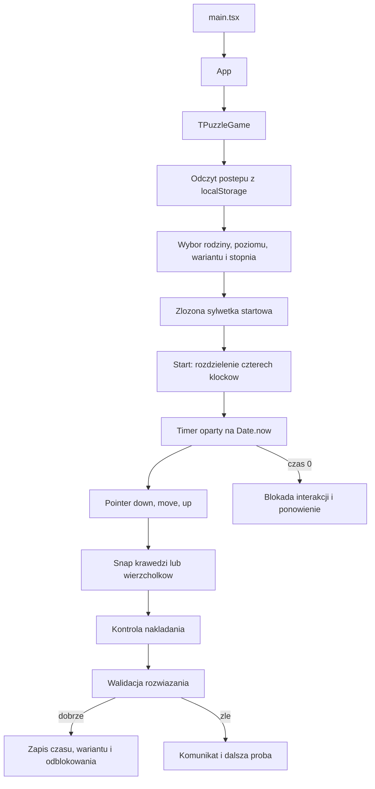

# Audyt T-Puzzle i specyfikacja kolejnej wersji

## 1. Stan aplikacji i zaleznosci

Projekt jest aplikacja React + TypeScript budowana przez Vite i publikowana jako PWA na GitHub Pages pod `/GryLogiczne2/`.

| Obszar | Aktualne rozwiazanie |
| --- | --- |
| Interfejs | React 19, React DOM, CSS responsywny |
| Ikony | `lucide-react` |
| Jezyk i build | TypeScript 5.8, Vite 7, `@vitejs/plugin-react` |
| Testy | Vitest 3, testy logiki geometrii, katalogu figur i postepu |
| Plansza | SVG, Pointer Events, `touch-action: none`, pointer capture |
| Dane gry | `src/games/t-puzzle`: definicje klockow, poziomow, masek i zweryfikowanych rozwiazan |
| Postep | `localStorage`: rodzina figur, poziom, warianty, stopien, czasy |
| PWA | manifest, ikony 192/512/maskable, service worker z cache offline |
| Publikacja | GitHub Actions i `vite.config.mjs` z `base: "/GryLogiczne2/"` |

Najwazniejsze katalogi:

- `src/games/t-puzzle/pieces.ts`: cztery kanoniczne klocki.
- `src/games/t-puzzle/generatedPuzzles.ts` i `verifiedPuzzleSolutions.generated.ts`: dane rozwiazan figur.
- `src/games/t-puzzle/levels.ts`: konfiguracja poziomow i wariantow.
- `src/games/t-puzzle/snap.ts`: przyciaganie i laczenie krawedzi.
- `src/games/t-puzzle/validation.ts`: walidacja ulozonej sylwetki.
- `src/games/t-puzzle/progress.ts`: zapis i odblokowywanie postepu.
- `src/games/t-puzzle/components/TPuzzleGame.tsx`: aktualny ekran gry.
- `public/t-puzzle/named` i `public/t-puzzle/named-solutions`: wektorowe podglady Gardner 1-36 oraz rozwiazania.
- `public/t-puzzle/targets`: zachowane obrazy zrodlowe 1-104.

## 2. Faktyczny przeplyw gry

1. Po uruchomieniu ladowany jest postep. Dostepny jest pierwszy poziom, a kolejne odblokowuje poprawne rozwiazanie jednego z trzech wariantow.
2. Wybrany wariant dostarcza jednolita, czarna sylwetke celu i zestaw poprawnych transformacji czterech klockow.
3. Przed startem widoczna jest zlozona figura. Nacisniecie Start uruchamia timer i animacje rozdzielenia na kolorowe elementy.
4. Przeciaganie przesuwa aktywny klocek lub scalona grupe. Podczas ruchu `findSnap` proponuje tylko pozycje bez nakladania.
5. Prawdziwy styk krawedzi scala klocki w grupe. Styk tylko wierzcholkow nie scala ich na stale.
6. Walidator porownuje wynik z prawdziwa geometria celu; nie powinien uznawac przypadkowego polozenia w poblizu wzoru. Dopuszczone sa tylko zdefiniowane symetrie, obroty i odbicia lustrzane sylwetki.
7. Sukces zatrzymuje timer, zapisuje wynik oraz odblokowuje nastepny poziom. Koniec czasu blokuje ruch do ponowienia proby.

## 3. Diagnoza ryzyka i przyczyn dotychczasowych bledow

1. **Interakcja i efekt wizualny byly pomieszane.** Lupa przesuwala klocek przy dotyku o wartosc techniczna, zeby nie byl pod palcem. To zmienialo prawdziwa geometrie ruchu i moglo uniemozliwic dosuniecie krawedzi. Zostala usunieta w calosci. Efekt wizualny nie moze nigdy zmieniac polozenia modelu gry.
2. **Jeden duzy komponent zawiera zbyt wiele odpowiedzialnosci.** `TPuzzleGame.tsx` laczy widok, timer, PWA, drag-and-drop, animacje, postep i modale. To sprzyja regresjom przy drobnych poprawkach.
3. **Zrodla danych figur nie sa jednolite.** Sa zachowane materialy rastrowe, wektorowe podglady i generowane rozwiazania. Dla czystej wersji kazda figura musi miec jedno zrodlo prawdy: cztery transformacje kanonicznych klockow. Z nich nalezy generowac cel, podglad i walidacje.
4. **Walidacja wymaga rygoru.** Tolerancja ma kompensowac dotyk i precyzje SVG, nie maskowac bledow. Nie wolno zwiekszac jej, aby "zaliczalo". Kazda plansza powinna miec test poprawnego rozwiazania, odbicia dozwolonego przez zasady oraz typowego falszywego ukladu.
5. **Brakuje testu calego interfejsu dotykowego.** Aktualne testy dobrze pokrywaja geometrie, postep i katalog, ale nie ma automatycznego scenariusza telefonu: start, przeciaganie, snap, sukces, blokada po czasie i widok na ekranie 360 x 800.
6. **Ekran postepu jest za gesty.** Panel z 34 poziomami i licznymi kontrolkami konkuruje z plansza. Na telefonie gra powinna miec najpierw plansze i czytelny pasek postepu, a katalog poziomow jako wysuwany panel.
7. **Rozmiar startowego bundla jest relatywnie duzy.** Wektorowe rozwiazania i katalogi warto w przyszlosci ladowac dynamicznie po otwarciu katalogu rozwiazan, ale nie kosztem niezawodnosci offline.
8. **Publikacja ma dwa tory.** GitHub Actions publikuje `dist`, a w repo sa tez statyczne pliki pomocnicze. Nastepna wersja powinna miec jedno, jasno opisane zrodlo publikacji: build Vite -> GitHub Pages.

## 4. Kierunek zmian: grywalna, czytelna wersja

### Architektura

- Wydziel czyste moduly: `geometry`, `snap`, `validator`, `puzzle-data`, `progress`, `timer`.
- Wydziel komponenty: `GameScreen`, `PuzzleBoard`, `PieceLayer`, `GameHud`, `LevelMap`, `AchievementSheet`, `InstallButton`, `StartSequence`.
- Zastap zestaw niezaleznych booleanow maszyna stanow: `idle -> launching -> playing -> solved | expired`.
- Kazda figura przechowuje `PieceTransform[]` dla czterech konkretnych klockow. Z tego samego zestawu danych generowane sa: czarna sylwetka, kolorowa podpowiedz dla nauczyciela i test walidacji.

### Dotyk i snap

- Klocek porusza sie dokladnie o wektor palca. Zadnego stalego przesuniecia, lupy ani korekty pod palec.
- Uzyj Pointer Events, `setPointerCapture`, obslugi `pointercancel` i `touch-action: none` wylacznie na planszy.
- Ustal przewidywalny snap: najpierw wspolna krawedz, potem dopiero wierzcholek. Po znalezieniu krawedzi pokazuj subtelny obrys styku, a po puszczeniu automatycznie wyrownaj pozycje.
- Scalone klocki przesuwaja sie jako jedna grupa. Nie nalezy ich odpychac, gdy moga utworzyc prawidlowy styk bez nakladania.
- Minimalny obszar przycisku: 44 x 44 px. Plansza ma dostac najwieksza czesc ekranu telefonu.

### Poziomy i osiagniecia

Zachowaj 34 poziomy po 3 warianty, ale pokaz je jako cztery strefy kampanii: Start, Kierunki, Transformacje i Mistrzowskie. Jedno rozwiazanie odblokowuje kolejny poziom; trzy rozwiazania daja pelne ukonczenie poziomu.

Proponowane odznaki:

- Pierwsza figura: pierwsze poprawne ulozenie.
- Pewna reka: trzy rozwiazania bez resetu.
- Szybki ruch: wynik ponizej polowy limitu czasu.
- Odkrywca: wszystkie trzy warianty poziomu.
- Mistrz odbicia: poprawne rozwiazanie dopuszczalnym odbiciem.
- Seria: trzy kolejne poziomy zaliczone.

Wizualnie: jednolity cel w granacie, cztery stale kolory klockow (niebieski, zielony, rozowy, zolty), ciemny kontrastowy obrys, spokojny blysk przy snapie, krotkie konfetti przy sukcesie. Animacje musza miec wariant dla `prefers-reduced-motion`.

## 5. Testy wymagane przed kazda publikacja

- Definicja czterech klockow: liczba wierzcholkow, pola, proporcje i katy.
- Kazda z 102 figur: istnieje dokladnie jedno rozwiazanie z czterech wlasciwych klockow, bez nakladania.
- Kazda figura: poprawne rozwiazanie jest zaliczane; cel z widoczna szczelina i zly ksztalt nie sa zaliczane.
- Osobny test: niebieski klocek snapuje do wspolnej krawedzi zielonego, bez odpychania i bez nakladania.
- Progresja: jeden wariant odblokowuje kolejny poziom; zablokowany poziom nie jest otwierany; zapis przetrwa odswiezenie.
- Timer: 75, 60, 45, 30, 15 sekund; brak wielu interwalow; zatrzymanie po sukcesie; blokada po czasie.
- Test Playwright na 360 x 800 i 412 x 915: plansza, przyciski, cel i Start sa widoczne; drag nie przewija strony; instalacja PWA jest poprawnie obsluzona.
- `npm test`, `npm run build`, sprawdzenie TypeScript i reczne sprawdzenie offline po swiezej instalacji PWA.

## 6. Gotowy prompt dla AI do przebudowy aplikacji

> Zbuduj od zera mobilna aplikacje PWA React + TypeScript + Vite pod GitHub Pages `/GryLogiczne2/`. To polska gra T-Puzzle dla wychowankow MOW Malbork. Priorytetem jest niezawodna, przyjemna gra na telefonie Android, nie efektowny prototyp.
>
> Uzyj dokladnie czterech kanonicznych elementow o zatwierdzonych proporcjach: niebieski dolny trapez trzonu (4 wierzcholki), zielony centralny pieciokat (5), rozowy trojkat prostokatny rownoramienny (3), zolty trapez (4). Nie wolno zastapic ich podobnymi trojkatami ani odtwarzac geometrii z bitmap. Zdefiniuj je jako punkty SVG w jednym module geometrii i pokryj testami dlugosci oraz pol.
>
> Zdefiniuj 34 poziomy po 3 warianty. Kazdy wariant ma zawierac identyfikator, polska nazwe, jednolita czarna sylwetke bez linii podzialu oraz dokladne `PieceTransform[]` czterech klockow. To jest jedyne zrodlo prawdy: z tych danych generuj podglad celu, kolorowa plansze rozwiazan dla nauczyciela i walidacje. Zachowaj dodatkowe figury jako bonusy. Nie dodawaj figury, zanim automatyczny test nie potwierdzi, ze jest skladalna z wlasciwych czterech klockow bez nakladania.
>
> Ekran gry ma miec stanowa maszyne `idle -> launching -> playing -> solved | expired`. Przed Start pokaz zlozona, jednolita sylwetke celu. Po Starcie wykonaj krotka animacje rozdzielenia na cztery kolorowe elementy, ale animacja nie moze zmieniac modelu geometrii ani utrudniac gry. Uzyj spokojnych czasteczek przy starcie i sukcesie, z obsluga `prefers-reduced-motion`.
>
> Plansza ma byc SVG obslugiwana przez Pointer Events. Uzyj `setPointerCapture`, `pointercancel`, `touch-action: none` tylko na planszy i minimum 44 px dla przyciskow. Klocek przesuwa sie dokladnie o wektor palca - bez ukrytego offsetu, lupy, przesuwania pod palec ani automatycznego odpychania. Przy zblizeniu prawidlowych, rownoleglych krawedzi ma nastepowac przyciaganie i idealne wyrownanie. Preferuj snap krawedzi nad snap wierzcholka, nie dopuszczaj nakladania i scalaj tylko klocki laczace sie rzeczywista krawedzia. Dodaj dyskretny obrys podpowiadajacy mozliwy styk, nie zaslaniajacy planszy.
>
> Walidacja ma byc rygorystyczna. Nie oceniaj tylko tego, czy klocki sa w obszarze celu. Porownuj ich transformacje z dopuszczonymi rozwiazaniami oraz sprawdzaj brak nakladania. Akceptuj odbicie lustrzane i obrot tylko wtedy, gdy caly wynik ma identyczna sylwetke celu oraz jest zgodny z fizycznymi transformacjami czterech klockow. Nie zwiekszaj tolerancji, aby ukryc blad danych.
>
> Zapisuj w `localStorage`: odblokowany poziom, rozwiazane warianty, wybrany stopien i najlepsze czasy. Poziom 1 jest dostepny od poczatku. Poprawne rozwiazanie jednego z trzech wariantow odblokowuje kolejny, a trzy rozwiazania oznaczaja pelne ukonczenie. Dodaj reset postepu z potwierdzeniem.
>
> Dodaj stopnie czasowe: 0 = 75 s, +1 = 60 s, +2 = 45 s, +3 = 30 s, Dyrektor = 15 s. Timer ma bazowac na `Date.now()`, zatrzymywac sie po sukcesie, nie tworzyc wielu interwalow i blokowac interakcje po czasie. Ostatnie 10 sekund ma byc wyraznie oznaczone bez dzwieku wymaganego do gry.
>
> Interfejs mobilny: plansza zajmuje wiekszosc ekranu, cel pozostaje widoczny w niewielkim panelu, a mapa poziomow jest wysuwanym i przewijalnym panelem. Pokazuj postep 1/3, blokady, medale i krotkie informacje o odblokowaniu. Uzyj kontrastowych stalych kolorow: niebieski `#2563EB`, zielony `#16A34A`, rozowy `#DB2777`, zolty `#F59E0B`, cel `#14213D`.
>
> PWA: poprawny manifest, ikony 192/512/maskable, service worker z wersjonowanym cache i bezpiecznym czyszczeniem starego cache, offline po pierwszym zaladowaniu oraz przycisk instalacji oparty na `beforeinstallprompt`. Ustaw Vite `base: "/GryLogiczne2/"` i dopasuj wszystkie sciezki do GitHub Pages.
>
> Zanim zakonczysz, napisz testy jednostkowe geometrii, snapa niebieski-zielony, walidacji wszystkich 102 wariantow, progresji i timera. Dodaj test Playwright na widoku telefonu dla startu, przeciagania, sukcesu i konca czasu. Uruchom `npm test`, `npm run build`, test TypeScript i sprawdz PWA offline. Nie publikuj wersji z bledem testow, figurami o zmienionym ksztalcie, czarna miniatura zamiast celu ani efektem wizualnym, ktory zmienia pozycje klocka.
